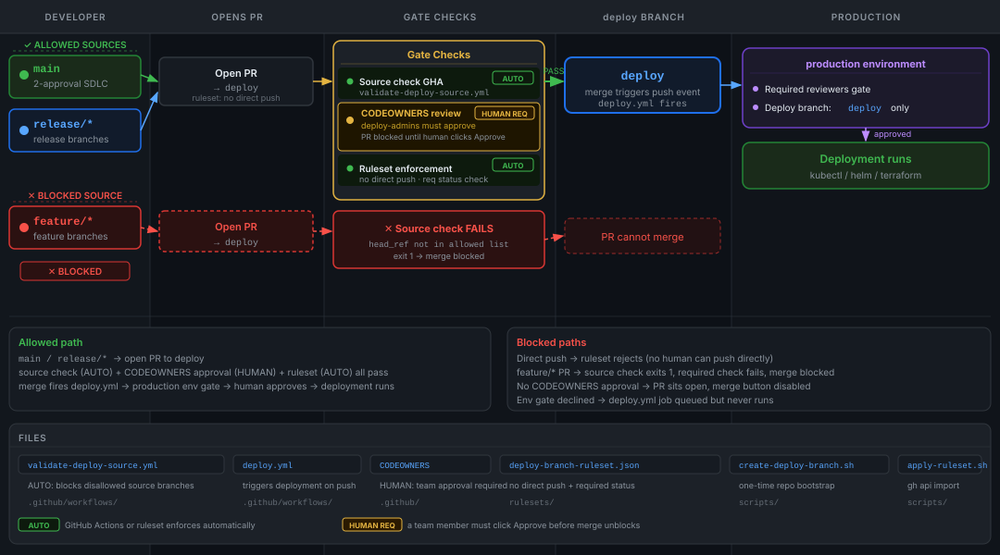

# Deploy Branch Policy — Flow Diagram



## Reading the diagram

Five swimlanes, left to right:

| Lane | What happens |
|------|-------------|
| **Developer** | Source branch identity — `main`, `release/*` (allowed) vs `feature/*` (blocked) |
| **Opens PR** | All merges to `deploy` must go through a PR — ruleset blocks direct push |
| **Gate Checks** | Three concurrent gates must all pass before merge is allowed |
| **deploy branch** | On merge, `deploy.yml` triggers via `push` event |
| **Production** | `production` environment gate — required reviewers must approve before job runs |

## Gates (column 3)

1. **Source check GHA** — `validate-deploy-source.yml` exits 1 if `head_ref` is not `main` or `release/*`; this is a required status check in the ruleset so a failing run blocks the merge button
2. **CODEOWNERS review** — `.github/CODEOWNERS` maps `*` to `@your-org/deploy-admins`; ruleset requires code-owner approval
3. **Ruleset enforcement** — `deploy-branch-ruleset.json` blocks all direct pushes and requires the status check above to pass

## Blocked paths

- **Direct push** — ruleset `restrict_pushes` rejects it regardless of who pushes
- **feature/* PR** — source check exits 1, required check fails, merge button stays disabled
- **No team approval** — CODEOWNERS + `require_code_owner_review: true` blocks the merge
- **Env gate declined** — `deploy.yml` job is queued but does not run until a required reviewer approves the `production` environment deployment

## Files

```
.github/workflows/validate-deploy-source.yml   source branch gate
.github/workflows/deploy.yml                   deployment workflow
.github/CODEOWNERS                             deploy-admins required reviewer
rulesets/deploy-branch-ruleset.json            ruleset (import via gh api)
scripts/apply-ruleset.sh                       one-command setup
scripts/create-deploy-branch.sh                one-time repo bootstrap
```
